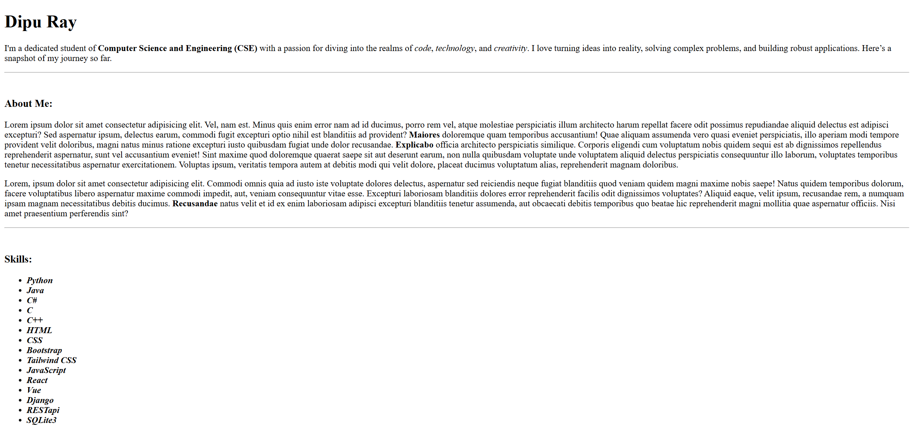
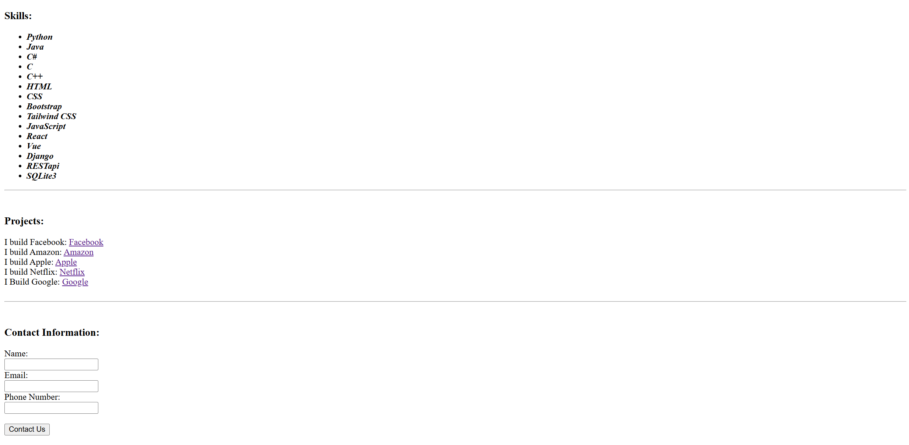

# 🌐 Personal Portfolio Website
📅 Date: February 11, 2026  
👨‍💻 Author: Dipu Ray  

---

## 📌 Project Overview
This is a personal portfolio website built using HTML.  
The purpose of this project is to develop my HTML coding skills better.

---

## ✨ Features
- About section
- Skills section
- Projects section
- Contact form

---

## 📂 Project Structure
```
personal-portfolio-website/
│── images/
    └── ss-image.png
    └── ss-image2.png
│── index.html
│── README.md

```

## 📸 Screenshot
<p align="center">
  
</p>
<p align="center">
  
</p>

---

⭐ If you like this project, feel free to give it a star!