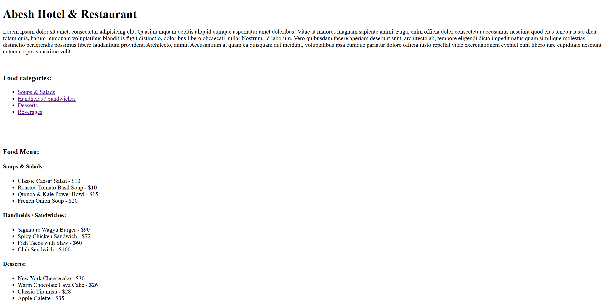
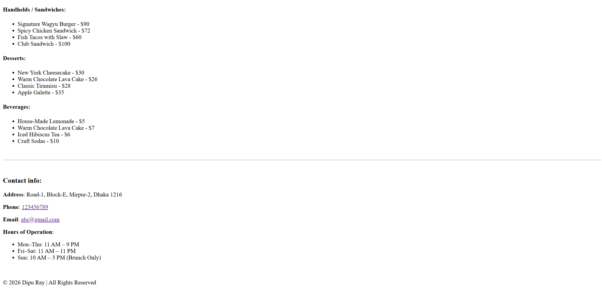

# 🌐 Restaurant Menu Page
📅 Date: February 13, 2026  
👨‍💻 Author: Dipu Ray  

---

## 📌 Project Overview
This is a restaurant menu page built using HTML.  
The purpose of this project is to develop my HTML coding skills better.

---

## ✨ Features
- Food categories
- There have food menu's
- Contact section

---

## 📂 Project Structure
```
restaurant-menu-page/
│── images/
    └── ss-image.png
    └── ss-image2.png
│── README.md
│── index.html

```

## 📸 Screenshot
<p align="center">
  
</p>
<p align="center">
  
</p>

---

⭐ If you like this project, feel free to give it a star!