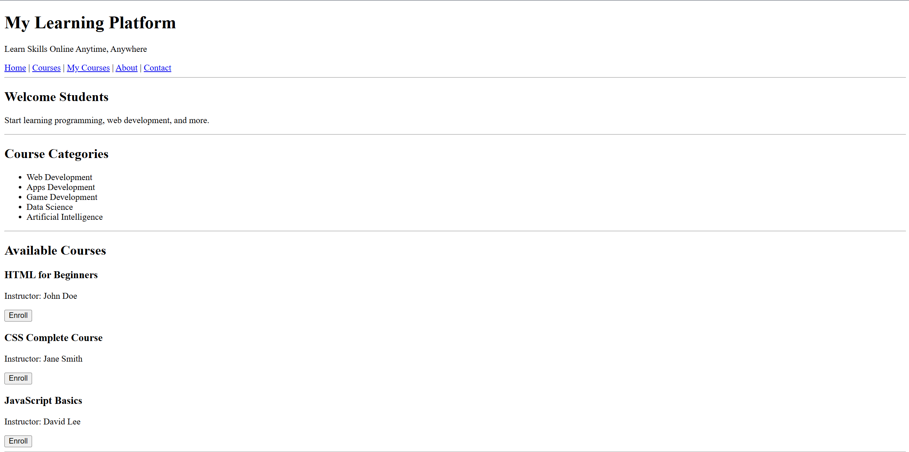
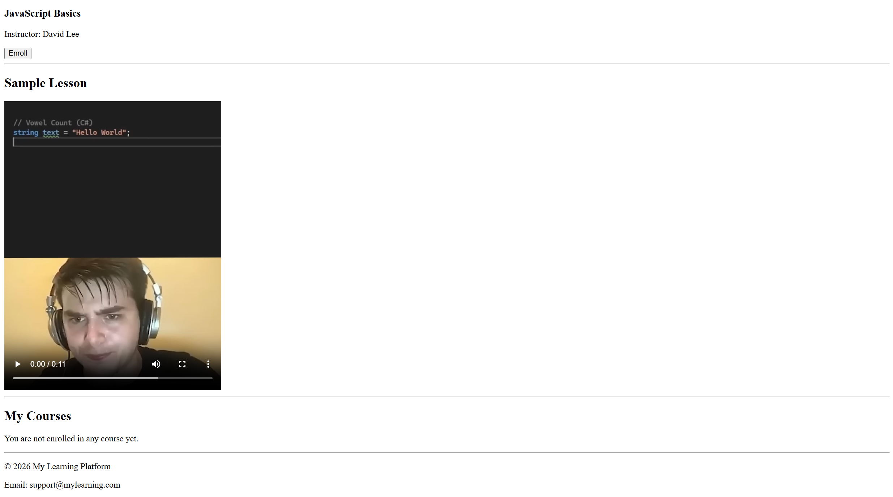

# 🌐 Registration Form Page
📅 Date: February 28, 2026  
👨‍💻 Author: Dipu Ray  

---

## 📌 Project Overview
This is a online learning platform web page using HTML.  
The purpose of this project is to develop my HTML coding skills better.

---

## ✨ Features
- Course Categories
- Available Courses
- My Courses

---

## 📂 Project Structure
```
online_learning_platform/
│── images/
    └── ss.png
    └── ss2.png
│── coding.mp4
│── index.html
│── README.md

```

## 📸 Screenshot
<p align="center">
  
</p>
<p align="center">
  
</p>

---

⭐ If you like this project, feel free to give it a star!